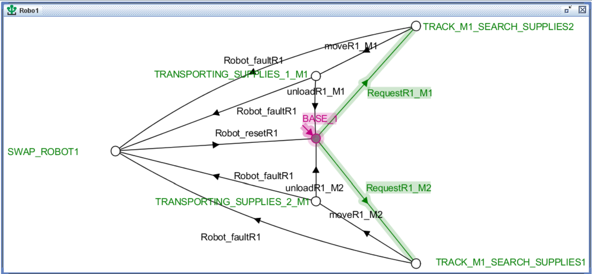
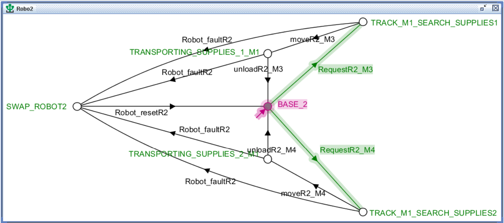
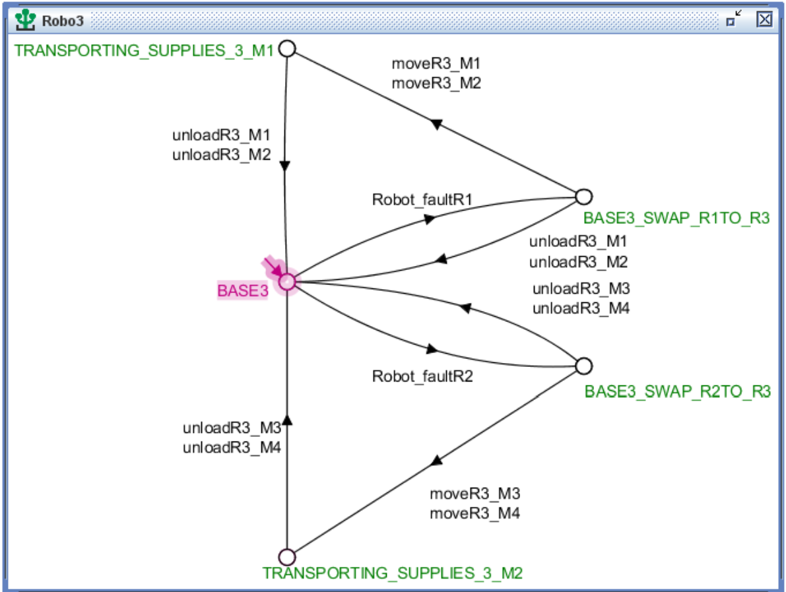
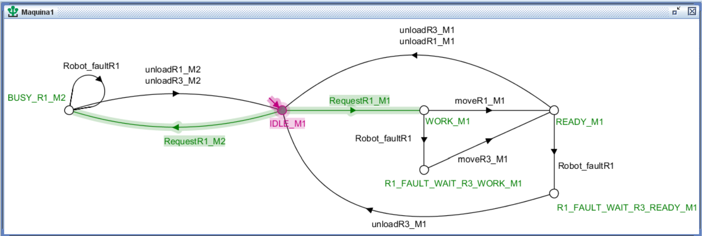
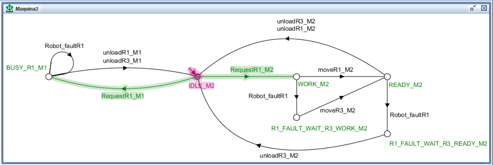
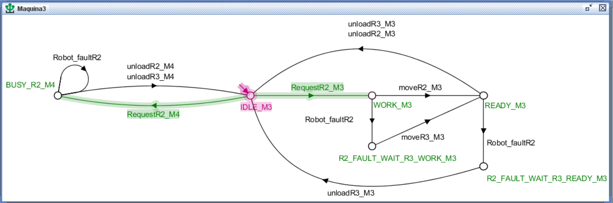
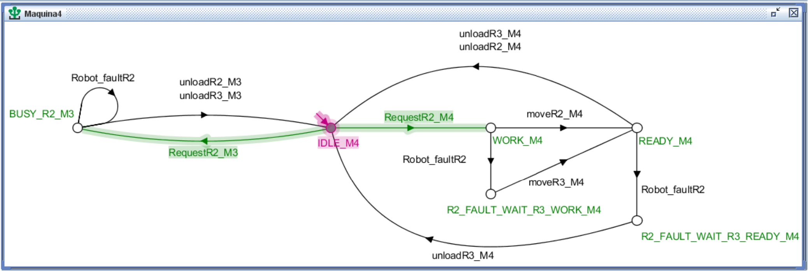
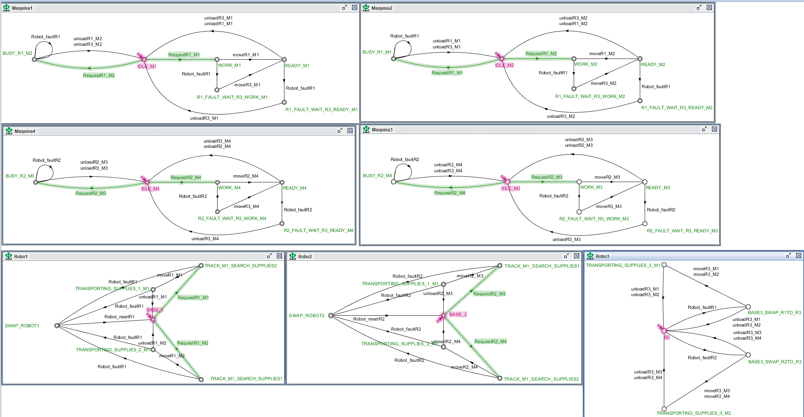

### Contribuidores
- Alexandre Basílio da Silva Júnior - 119110494 
- Marcos Aurélio Pinheiro Leal      - 124110974 
- Valmir Ferreira da Silva          - 119211110
# Controle de um Sistema de Robôs Autônomos em um Armazém

## Descrição do Projeto

Este projeto tem como objetivo desenvolver um sistema de controle supervisionado para robôs autônomos em um armazém automatizado. O sistema é composto por três robôs (R1, R2 e R3) que transportam caixas de insumos entre um buffer de com duas Entrada (BE) e quatro máquinas de processamento (M1, M2, M3 e M4).

### Problema Resolvido

O problema central deste projeto é a coordenação de múltiplos robôs autônomos em um ambiente compartilhado, onde eles precisam acessar o Buffer de Entrada para retirar insumos e entregá-los às máquinas de processamento:

1. **Controle de Acesso aos Buffers de Entrada (BE1 e BE2):**
   - Para simplificar o modelo e evitar colisões, foram adotados um Buffer com duas de Entrada. Isso permite que os robôs acessem diferentes áreas de coleta de insumos simultaneamente, reduzindo a necessidade de modelar o risco de conflitos.
  -  simultaneamente, tornando desnecessidade dos eventos de espera(wait) e risco de colisões(risk_collison).
  -   O robô R3 é uma redundância do sistema, ele possuirá uma maior robustes fisíca e sua função principal é se descolar até R1 e R2, caso falhem, e coletar os insumos associcados substituindo-os. Aqui o deslocamento até o robô defeituoso foi abstraido bem como ao usar o argumento da robustes fisíca implicará que não será admito que ele falhará no  modelo desenvolvido foi considerado também que só teremos solicitações de requisições para os robôs R1 e R2 caso falhem, R3 assumira, mas não atenderá requisições obrigando que os robôs 1 e 2 sejam reiniciados apenas simplificações de projeto.

2. **Tratamento de Falhas:**
   - **O robô R3 foi designado como substituto em caso de falha de R1 ou R2. Quando um robô falha, o R3 assume a tarefa do robô que falhou, deslocando-se para o local onde a falha ocorreu e completando a tarefa solicitada.**
   - Eventos de falha e reinicialização dos robôs foram modelados para garantir que o sistema possa se recuperar de problemas inesperados.
   - **Reset dos Robôs (R1 e R2):** Caso um robô (R1 ou R2) falhe, ele pode ser resetado e voltar a funcionar normalmente. Após o reset, o robô fica apto para ser utilizado novamente. Caso contrário, ele permanece indisponível para novas requisições até que seja reinicializado.

3. **Síntese do Supervisor:**
   - Utilizamos a ferramenta Supremica para modelar o sistema e gerar um supervisor que garante a operação segura e eficiente dos robôs.
   - O supervisor foi projetado para lidar com eventos controláveis (como movimentação dos robôs) e não controláveis (como falhas e solicitações de transporte).

### Funcionamento do Sistema

O sistema opera com base em eventos controláveis e não controláveis:

```
Eventos Controláveis:

move(Ri, BE, Mx): O robô Ri transporta uma caixa do Buffer de Entrada BE para a máquina Mx.
unload(Ri, Mx): O robô Ri entrega a caixa na máquina Mx.

Eventos Não Controláveis:

request(Ri,BE, Mx): Uma nova solicitação de transporte para o robô Ri surge do Buffer de Entrada para a máquina Mx.
robot_fault(Ri): O robô Ri apresenta falha.
robot_reset(Ri): O robô Ri volta a funcionar normalmente após uma falha.
```
### Descrição dos Autômatos

**Robô R1 e R2**

Eles são responsáveis por transportar caixas de insumos do Buffer de Entrada (BE) para à máquina de
processamento Mx. O autômato é composto por estados e transições que modelam as ações do
robô, incluindo movimentação, falhas e reset.

**Estados:**
1. **BASEi**: Estado inicial onde o robô R1.
2. **TRACK_Mx_SEARCH_SUPPLIESi** :  Buscando suprimentos no Buffer de Entrada (BE) para transportar para a máquina M1, M2, M3 ou M4.
3. **SWAP_ROBOTi** : Estado onde o robô R1 pode ser substituído pelo robô R3 em caso de falha.
4. **Robot_faultRi_Mx** : Estados de falha do robô Ri, onde Mx representa uma máquina específica
    (M1, M2, M3 ou M4). Cada estado de falha indica que o robô Ri apresentou uma falha durante o transporte
    para uma das máquinas.
**Transições:**

```
move(Ri, BE, Mx) : O robô Ri transporta uma caixa do Buffer de Entrada (BE) para a máquina Mx
(M1, M2, M3 ou M4).
wait(Ri) : O robô Ri aguarda caso o Buffer de Entrada (BE) esteja ocupado.
unload(Ri, Mx) : O robô Ri entrega a caixa na máquina Mx.
robot_fault(Ri) : O robô Ri apresenta uma falha durante o transporte, levando a um dos estados
de falha (Robot_faultRi_Mx).
robot_reset(Ri) : O robô Ri é resetado e volta a funcionar normalmente após uma falha,
retornando ao estado inicial, ficando disponível para novas requisições.
```
**Eventos:**

```
Eventos Controláveis:
1. move(Ri, BE, Mx): O robô Ri transporta uma caixa do BE para à máquina Mx.
2. wait(Ri): O robô Ri aguarda caso o BE esteja ocupado.
3. unload(Ri, Mx): O robô Ri entrega a caixa na máquina Mx.
Eventos Não Controláveis:
4. robot_fault(Ri): O robô Ri apresenta uma falha durante o transporte.
5. robot_reset(Ri): O robô Ri é resetado e volta a funcionar normalmente após uma falha.
```
### Funcionamento do Autômato dos Robôs

1. **Operação Normal:**
    O robô Ri começa no estado **BASEi** ao receber uma requisão vai para **TRACK_Mx_SEARCH_SUPPLIESi**, onde ele buscará
    suprimentos no Buffer de Entrada (BE) para transportar para à máquina respectiva. Quando o evento move(Ri, BE, Mx) acontecer R1 transportará a caixa do BE para a máquina Mx.
    Após entregar a caixa, ele retorna ao estado inicial **BASEi** até receber uma nova requisão
2. **Falha e Reset:**
    Se o robô Ri falhar durante o transporte (robot_fault(Ri)), ele entra em um dos estados de
    falha ( **Robot_faultRi_Mx** ), onde Mx representa a máquina para a qual ele estava
    transportando a caixa.
    Após a falha, o robô Ri pode ser resetado (robot_reset(R1)), retornando ao estado inicial e
    ficando disponível para novas requisições.
3. **Substituição por R3:**

    **Em caso de falha, o robô R3 irá substituir o Ri, assumindo a tarefa de transporte. O estado SWAP_ROBOT1 representa essa substituição, em que o R3 se desloca até o local do robô defeituoso, coleta o insumo e continua a execução da tarefa associada ao Ri.**


| Robô 1  | Robô 2 | 
|----------|----------|
|  |  |  
### Robô 03


O robô R3 atua como um robô redundância do sistema, assumindo as tarefas de R1 ou R2 em caso de falha
responsável por transportar caixas de insumos do Buffer de Entrada (BE) para as máquinas de
processamento Mx. O autômato é composto por estados e transições que modelam as
ações do robô, incluindo movimentação, descarga de caixas, falhas e substituição de outros robôs.

### Descrição do Autômato Robo 03

**Estados:**

1. **TRANSPORTING_SUPPLIES_3_M1** : Estado onde o robô R3 está transportando suprimentos do
    Buffer de Entrada (BE) para a máquina M1 ou M2.
2. **TRANSPORTING_SUPPLIES_3_M2** : Estado onde o robô R3 está transportando suprimentos do
    Buffer de Entrada (BE) para a máquina M3 ou M4.
3. **BASE3_SWAP_R1TO_R3** : Estado onde o robô R3 substitui o robô R1 em caso de falha.
4. **BASE3_SWAP_R2TO_R3** : Estado onde o robô R3 substitui o robô R2 em caso de falha.
5. **Robot_faultRi** : Estado onde o robô Ri falhou, e o robô R3 pode assumir suas tarefas.


**Transições:**

```
moveR3_Mx : O robô R3 transporta uma caixa do Buffer de Entrada (BE) para a máquina Mx.
unloadR3_Mx : O robô R3 entrega a caixa na máquina Mx.
Robot_faultRi : O robô Ri apresenta uma falha, e o robô R3 assume suas tarefas.
```
**Eventos:**

```
Eventos Controláveis:
moveR3_Mx: O robô R3 transporta uma caixa do BE para a máquina Mx.
unloadR3_Mx: O robô R3 entrega a caixa na máquina Mx.
Eventos Não Controláveis:
Robot_faultRi: O robô Ri apresenta uma falha, e o robô R3 assume suas tarefas.
```
### Funcionamento do Autômato Robo

1. **Operação Normal/Substituição de Ri:**
    O robô R3 começa no estado **BASE3** ao ocorrer uma falha Robot_faultRi alterá para o estado **BASE3_SWAP_R1TO_R3** ao ocorrer moveR3_Mx irá para **TRANSPORTING_SUPPLIES_3_Mx**, onde ele transportará o suprimentos do Buffer de
    Entrada (BE) para as máquinas ou a descarga do suprimento da máquina Mx.
    e/ou unloadR3_Mx que voltará para o estado inical **BABSE3**
<p align="center" width="100%" title="Robô 3">
     
</p>


### Máquina 0x

Ela modela os estados da máquina Mx, incluindo operações normais, falhas de robôs, requisições de
transporte e interações com os robôs Ri.

### Descrição dos Estados do Autômato M

**Estados:**

1. **IDLE_Mx** : Estado inicial onde a máquina Mx está ociosa, aguardando uma requisição de transporte
    de insumos.
2. **RequestRi_Mx** : Estado onde a máquina Mx solicita ao robô Ri para transportar uma caixa do
    Buffer de Entrada (BE) para a máquina Mx.
3. **WORK_Mx** : Estado onde a máquina Mx está processando/trabalhando em uma caixa de insumos entregue pelo
    robô Ri.
4. **READY_Mx** : Estado onde o robô Ri leva o insumo para a máquina Mx que realizou a solicitação.
5. **Robot_faultRi** : Estado onde o robô Ri falhou durante o transporte de uma caixa para a máquina
    Mx.
6. **Ri_FAULT_WAIT_R3_WORK_Mx** : Estado onde a máquina Mx aguarda que o robô R3 assuma a
    tarefa de transporte após a falha do robô Ri.
7. **BUSY_Ri_Mx** : Estado onde o robô Ri está ocupado transportando uma caixa para a máquina M2,
    e a máquina Mx aguarda sua disponibilidade.
8. **RequestRi_Mx** : Estado onde a máquina Mx solicita ao robô Ri para transportar uma caixa para a
    máquina Mx.
9. **unloadR1_Mx** : Estado onde o robô R1 descarrega uma caixa na máquina M1 ou M2.
10. **unloadR3_Mx** : Estado onde o robô R3 descarrega uma caixa na máquina Mx.
11. **moveR3_Mx** : Estado onde o robô R3 está transportando uma caixa do Buffer de Entrada (BE) para
a máquina Mx.


### Funcionamento do Autômato Mx

1. **Operação Normal:**
    A máquina Mx começa no estado **IDLE_Mx** , onde está ociosa e aguarda uma requisição de
    transporte.
    Quando uma requisição é feita, a máquina Mx entra no estado **RequestRi_Mx** , solicitando ao
    robô Ri para transportar uma caixa do BE para a máquina Mx.
    Após o robô Ri entregar a caixa, a máquina Mx entra no estado **WORK_Mx** , onde processa a
    caixa de insumos.
2. **Falha do Robô Ri:**
    Se o robô Ri falhar durante o transporte (Robot_faultRi), a máquina Mx entra no estado
    **Robot_faultRi**.
    A máquina Mx então aguarda que o robô R3 assuma a tarefa, passando pelos estados
    **Ri_FAULT_WAIT_R3_WORK_Mx**.
    O robô R3 realiza o transporte da caixa para a máquina Mx (moveR3_Mx) e descarrega a caixa
    (unloadR3_Mx).

| Máquina 1  | Máquina 2 | 
|----------|----------|
|  |  |  


| Máquina 3  | Máquina 4 | 
|----------|----------|
|  |  |


### Sistema completo

<p align="center" width="100%">
     
</p>

## Como Executar o Projeto

Para executar o projeto e entender o funcionamento do sistema

### 1. Instalar o Java
O Supremica requer o Java para funcionar,para instalar o Java Development Kit (JDK):
**Passo 1: Atualize o sistema**
```bash
sudo apt update
```
**Passo 2: Instale o JDK**
Você pode instalar o OpenJDK, que é uma versão aberta do Java:
```bash
sudo apt install openjdk-17-jdk
```
**Passo 3: Verifique a instalação**
Após a instalação, verifique se o Java foi instalado corretamente:
```bash
java -version
```
### 2. Instalar o Graphviz
O Graphviz é necessário para visualizar os diagramas gerados pelo Supremica.
**Passo 1: Instale o Graphviz**
```bash
sudo apt install graphviz
```
**Passo 2: Verifique a instalação**
Após a instalação, verifique se o Graphviz foi instalado corretamente:
```bash
dot -V
```
### 3. Baixar e Executar o Supremica
Agora que o Java e o Graphviz estão instalados, você pode baixar e executar o Supremica.
**Baixe o Supremica**
Acesse o link da versão mais recente do Supremica no GitHub:
[Release Waters/Supremica IDE 2.7.1](https://github.com/robimalik/Waters/releases/tag/v2.7.1)
Baixe o arquivo `.jar` para o seu diretório de trabalho.
**Execute o Supremica**
Navegue até o diretório onde o arquivo `.jar` foi baixado e execute
```bash
java -jar Supremica.jar
```
Você também poderá baixar um script para baixar e instalar todas as depedências necessárias em
install.sh
### Vídeo de Demonstração
Para uma explicação detalhada do funcionamento do sistema e uma demonstração da simulação,
[Vídeo de Demonstração do Funcionamento](https://youtu.be/cJdnjmNx034)


### Links Úteis

- [Tutorial Supremica](https://github.com/kyllercg/tutorial-supremica): Um mini tutorial sobre como usar o Supremica.
  
Este projeto foi desenvolvido como parte da disciplina de Sistemas de Eventos Discretos (SED) e visa
demonstrar a aplicação de controle supervisionado em sistemas de robótica autônoma. A adoção de
dois Buffers de Entrada e o tratamento eficiente de falhas dos robôs são aspectos importantes que
garantem a robustez e eficiência do sistema.


